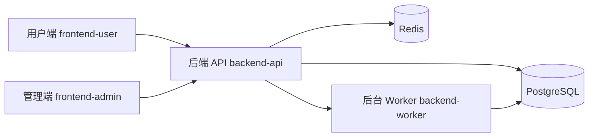

# 商业对象智能深度调研分析平台


## 推荐启动方式

如果你本地已经完成过一次依赖安装和 Python 虚拟环境准备，当前最方便的开发启动方式是在 `src/` 目录直接使用一键脚本：

```powershell
cd src
.\dev-start.cmd
```

默认会启动：

- `backend-api`
- `frontend-user`
- `backend-worker`
- `docker compose` 中的 PostgreSQL 和 Redis

常用参数：

```powershell
.\dev-start.cmd -InitDb
.\dev-start.cmd -WithAdmin
.\dev-start.cmd -NoWorker
```

配套脚本：

```powershell
.\dev-status.cmd
.\dev-stop.cmd
```

说明：

- `.\dev-start.cmd -InitDb` 会在启动前执行数据库迁移和初始数据写入
- `-WithAdmin` 会额外启动管理端
- `-NoWorker` 适合只调前端界面或接口联调时使用
- 一键脚本是开发便捷入口，但仍然依赖你已经准备好 `backend-api/.venv`、`backend-worker/.venv` 和前端 `node_modules`

## 手动启动方式

如果你需要逐个排查服务、单独调试某一层，原来的手动启动方式仍然可用，推荐顺序如下：

1. 在 `src/` 目录执行 `docker compose up -d`
2. 启动 `backend-api`
3. 启动 `backend-worker`
4. 启动 `frontend-user`
5. 如有需要再启动 `frontend-admin`

一个面向 **公司、股票、商品** 三类商业对象的智能深度调研分析平台。  
项目采用 B/S 架构，围绕“发起调研 -> 任务执行 -> 过程跟踪 -> 后台治理”构建统一链路，支持用户端调研工作流、管理端治理工作流以及后台 Worker 执行链路。

## 当前落地状态

截至 2026-04-24，项目已经接入 Gemini API，并启用 Gemini Google Search grounding 配置；股票 DeepResearch 已形成“任务创建 -> 行情材料采集 -> Gemini 分析 -> Markdown 报告 -> 前端展示”的可运行闭环。

需要特别说明的是：公司和商品目前主要是产品入口与界面预留，后端 `POST /research/tasks` 和 Worker 仍只支持 `STOCK`。下一阶段的核心不是继续堆页面，而是把信息源层做扎实：先接入权威 API/公开数据源，统一沉淀为可引用材料，再由 Gemini 做联网补充、交叉核验和报告生成。

## 项目亮点

- 平台结构面向公司、股票、商品三类对象设计，当前后端闭环优先落地股票对象
- 提供用户端研究工作台、任务中心、任务详情、个人中心
- 提供管理端概览面板、模型管理、用户管理、任务治理、审计日志
- 支持 JWT 认证与基础 RBAC 权限控制
- 支持调研任务入队、Worker 领取、阶段日志记录与状态流转
- 支持 Gemini 模型调用与 Google Search grounding 兜底检索
- 使用 PostgreSQL 持久化任务、配置、日志、结果等核心数据
- 使用 Alembic 管理数据库迁移，支持初始化脚本和种子数据脚本
- 提供 Docker Compose 基础依赖编排，降低本地启动成本

## 系统架构



## 核心能力

### 用户端

- 用户注册、登录、会话恢复
- 调研工作台：创建调研任务、选择对象类型、模型、时间范围、调研目标
- 任务中心：查看任务列表、筛选任务、跳转详情
- 任务详情：查看任务状态、阶段进度、阶段日志、基础任务参数
- 个人中心：查看当前账户与会话信息

### 管理端

- 管理员登录与权限校验
- 概览面板：查看用户、任务、模型、日志等关键指标
- 模型管理：查看模型配置与启用状态
- 用户管理：查看用户列表、角色信息、任务活跃度
- 任务治理：查看全局任务队列与处理状态
- 审计日志：检索后台关键操作记录

### 后端与执行链路

- FastAPI 提供统一 API 服务
- PostgreSQL 持久化用户、任务、阶段日志、模型配置、信息源配置等核心数据
- Worker 轮询领取任务并推进阶段状态
- Alembic 管理数据库迁移
- 初始化脚本自动写入默认角色、默认模型、默认信息源、默认管理员

## 技术栈

| 层级 | 技术 |
| --- | --- |
| 用户端 | React 18、TypeScript、Vite、React Router |
| 管理端 | React 18、TypeScript、Vite、React Router |
| 后端 API | FastAPI、SQLAlchemy、Pydantic Settings、PyJWT |
| 后台执行 | Python Worker、SQLAlchemy |
| 数据库 | PostgreSQL 16 |
| 缓存/预留基础设施 | Redis 7 |
| 迁移管理 | Alembic |
| 容器编排 | Docker Compose |

## 仓库结构

```text
.
├─ README.md
├─ 要求.md
├─ 其他参考文档/
├─ 概要设计文档/
├─ 需求规格说明书/
└─ src/
   ├─ .env.example
   ├─ docker-compose.yml
   ├─ backend-api/
   │  ├─ alembic/
   │  ├─ app/
   │  ├─ scripts/
   │  └─ requirements.txt
   ├─ backend-worker/
   │  ├─ research_worker/
   │  └─ requirements.txt
   ├─ frontend-user/
   │  ├─ src/
   │  └─ package.json
   ├─ frontend-admin/
   │  ├─ src/
   │  └─ package.json
   └─ shared/
```

## 快速开始

### 1. 运行环境

建议使用以下环境：

- `Git`
- `Python 3.11+`
- `Node.js 18+`
- `npm 9+`
- `Docker Desktop` 与 `Docker Compose`

> 下文默认使用 **Windows PowerShell** 演示命令。  
> 如果你使用 macOS / Linux，只需要把虚拟环境激活命令替换为 `source .venv/bin/activate`，其余流程保持一致。

### 2. 克隆仓库

```powershell
git clone <your-repo-url>
cd <your-repo-folder>
```

### 3. 配置环境变量

项目运行配置分两层：

- `src/.env`：可提交到 GitHub 的公共默认配置，只放占位值或团队可共享配置。
- `src/.env.local`：本机私密配置，用来放真实 API Key；该文件已被 `.gitignore` 忽略，不会提交到 GitHub。

先复制一份环境变量模板：

```powershell
cd src
Copy-Item .env.example .env
Copy-Item .env.example .env.local
```

本地开发时，把真实密钥写进 `src/.env.local`。程序会自动优先读取 `.env.local`，所以不需要来回改 `src/.env`。

建议你第一次运行时，至少检查并确认下面这些配置：

| 变量 | 说明 | 建议值 |
| --- | --- | --- |
| `POSTGRES_DB` | PostgreSQL 数据库名 | `research_platform` |
| `POSTGRES_USER` | PostgreSQL 用户名 | `postgres` |
| `POSTGRES_PASSWORD` | PostgreSQL 密码 | `postgres` |
| `POSTGRES_HOST` | PostgreSQL 主机 | `127.0.0.1` |
| `POSTGRES_PORT` | PostgreSQL 端口 | `5432` |
| `REDIS_PORT` | Redis 端口 | `6379` |
| `JWT_SECRET` | JWT 签名密钥 | 建议改成你自己的随机字符串 |
| `DEFAULT_ADMIN_USERNAME` | 默认管理员用户名 | `admin` |
| `DEFAULT_ADMIN_EMAIL` | 默认管理员邮箱 | 自定义即可 |
| `DEFAULT_ADMIN_PASSWORD` | 默认管理员密码 | 建议改成你容易记住的密码 |
| `CORS_ALLOWED_ORIGINS` | 前端跨域白名单 | 保持模板默认值即可 |
| `GEMINI_API_KEY` | Gemini 模型调用密钥 | 只填在 `src/.env.local`，不要提交到 GitHub |
| `GEMINI_GOOGLE_SEARCH_ENABLED` | 是否允许 Gemini 联网检索兜底 | 本地开发建议保持 `true` |
| `ALPHA_VANTAGE_API_KEY` | Alpha Vantage 数据源密钥 | 推荐填在 `src/.env.local` |
| `FRED_API_KEY` | FRED 数据源密钥 | 推荐填在 `src/.env.local` |
| `EIA_API_KEY` | EIA 数据源密钥 | 推荐填在 `src/.env.local` |
| `SEC_USER_AGENT` | SEC EDGAR 请求头身份 | 可填项目名与联系邮箱 |
| `TUSHARE_TOKEN` | Tushare Pro token | 可选，推荐填在 `src/.env.local` |

如果只是本地首次启动，直接沿用模板中的数据库端口和主机配置即可。

## 推荐启动方式：使用 Docker 启动数据库与 Redis

这是最推荐的新手启动方式。  
原因很简单：**不用手动安装 PostgreSQL 和 Redis，本地环境更稳定，踩坑更少。**

### 4. 启动 PostgreSQL 与 Redis

在 `src/` 目录下执行：

```powershell
docker compose up -d
```

查看容器状态：

```powershell
docker compose ps
```

如果看到 `research-postgres` 和 `research-redis` 处于运行状态，说明基础依赖已经启动成功。

### 5. 启动后端 API

打开一个新的终端窗口，进入 `src/backend-api`：

```powershell
cd src\backend-api
python -m venv .venv
.\.venv\Scripts\Activate.ps1
pip install -r requirements.txt
alembic -c alembic.ini upgrade head
python .\scripts\seed_initial_data.py
python -m uvicorn app.main:app --reload --host 127.0.0.1 --port 8000
```

启动成功后，访问下面两个地址进行检查：

- 健康检查：`http://127.0.0.1:8000/health/live`
- 就绪检查：`http://127.0.0.1:8000/health/ready`

如果 `ready` 返回数据库就绪信息，说明 API 与数据库已经打通。

### 6. 启动后台 Worker

再打开一个新的终端窗口，进入 `src/backend-worker`：

```powershell
cd src\backend-worker
python -m venv .venv
.\.venv\Scripts\Activate.ps1
pip install -r requirements.txt
python -m research_worker.main --stage-delay 2
```

说明：

- `--stage-delay 2` 会让阶段切换更容易观察，适合本地演示
- 如果你只想处理当前队列后退出，可以改用：

```powershell
python -m research_worker.main --once --stage-delay 2
```

### 7. 启动用户端

再打开一个新的终端窗口，进入 `src/frontend-user`：

```powershell
cd src\frontend-user
npm install
npm run dev
```

启动完成后，访问：

- 用户端：`http://127.0.0.1:5173`

### 8. 启动管理端

再打开一个新的终端窗口，进入 `src/frontend-admin`：

```powershell
cd src\frontend-admin
npm install
npm run dev
```

启动完成后，访问：

- 管理端：`http://127.0.0.1:5174`

## 启动顺序建议

第一次运行时，建议按下面顺序启动：

1. `src/docker-compose.yml` 中的 PostgreSQL 与 Redis
2. `backend-api`
3. `backend-worker`
4. `frontend-user`
5. `frontend-admin`

这个顺序最稳，也最适合排查问题。

## 首次使用指南

### 普通用户使用流程

1. 打开用户端 `http://127.0.0.1:5173`
2. 注册一个普通用户账号
3. 登录后进入调研工作台
4. 选择对象类型、输入对象名称、填写调研目标和时间范围
5. 提交调研任务
6. 跳转到任务详情页，观察任务状态、阶段日志与进度变化
7. 在任务中心查看自己的历史任务

### 管理员使用流程

管理员账号由初始化脚本根据 `src/.env` 中的以下配置自动创建：

- `DEFAULT_ADMIN_USERNAME`
- `DEFAULT_ADMIN_EMAIL`
- `DEFAULT_ADMIN_PASSWORD`

使用流程：

1. 打开管理端 `http://127.0.0.1:5174`
2. 使用 `src/.env` 中配置的管理员账号登录
3. 查看概览、模型、用户、任务和审计日志

如果你修改了管理员用户名或密码，重新执行一次下面的命令即可重新同步初始化数据：

```powershell
cd src\backend-api
.\.venv\Scripts\Activate.ps1
python .\scripts\seed_initial_data.py
```

## 不使用 Docker 可以吗？

可以，但对新手不推荐。

如果你想不用 Docker，请确保本机已经安装并启动：

- PostgreSQL
- Redis

然后把 `src/.env` 中的数据库和 Redis 配置改成你本机实际环境：

- `POSTGRES_HOST`
- `POSTGRES_PORT`
- `POSTGRES_DB`
- `POSTGRES_USER`
- `POSTGRES_PASSWORD`
- `REDIS_PORT`

只要这些配置与本机服务一致，后端 API 和 Worker 就可以正常连接。

## 常见问题

### 1. `docker compose up -d` 失败

请先确认：

- Docker Desktop 已经启动
- 当前终端可以正常执行 `docker` 和 `docker compose`

可以执行：

```powershell
docker --version
docker compose version
```

### 2. 访问 `/health/ready` 返回数据库未就绪

通常有三种原因：

- PostgreSQL 容器还没完全启动
- `.env` 中数据库连接信息不正确
- 还没有执行数据库迁移

建议按顺序检查：

```powershell
cd src
docker compose ps
```

然后确认已经执行过：

```powershell
cd src\backend-api
alembic -c alembic.ini upgrade head
python .\scripts\seed_initial_data.py
```

### 3. 前端页面打开了，但接口请求失败

请依次检查：

- `backend-api` 是否已经启动在 `8000` 端口
- `src/.env` 中的 `CORS_ALLOWED_ORIGINS` 是否包含 `5173` 和 `5174`
- 如果你修改了 API 端口，前端是否同步配置了 `VITE_API_BASE_URL`

### 4. 管理员登录失败

请确认你登录使用的是 `src/.env` 中配置的管理员账号，并重新执行一次种子脚本：

```powershell
cd src\backend-api
.\.venv\Scripts\Activate.ps1
python .\scripts\seed_initial_data.py
```

### 5. 端口被占用

如果 `5432`、`6379`、`8000`、`5173`、`5174` 被其他程序占用：

- 修改 `src/.env` 中对应端口
- 重新启动对应服务
- 如果修改了 API 端口，记得同步调整前端 API 地址

## 停止服务

### 停止前端 / API / Worker

在对应终端窗口按 `Ctrl + C` 即可。

### 停止 Docker 基础依赖

```powershell
cd src
docker compose down
```

如果你想连同数据库数据卷一起清理：

```powershell
docker compose down -v
```

> 这会删除本地 PostgreSQL / Redis 持久化数据，仅在你明确需要重置本地环境时使用。

## 开发说明

### 用户端默认地址

- `http://127.0.0.1:5173`

### 管理端默认地址

- `http://127.0.0.1:5174`

### API 默认地址

- `http://127.0.0.1:8000`

### 当前基础接口

- `GET /health/live`
- `GET /health/ready`
- `POST /auth/register`
- `POST /auth/login`
- `GET /auth/me`
- `GET /auth/admin-check`
- `GET /research/models`
- `POST /research/tasks`
- `GET /research/tasks`
- `GET /research/tasks/{task_id}`
- `GET /research/tasks/{task_id}/status`
- `GET /admin/overview`
- `GET /admin/models`
- `GET /admin/users`
- `GET /admin/audit-logs`

## 适合的演示方式

如果你是第一次体验本项目，最推荐的演示顺序是：

1. 启动 PostgreSQL、Redis、API、Worker、用户端、管理端
2. 在用户端注册普通账号并登录
3. 创建一条调研任务
4. 在任务详情页观察任务状态推进和阶段日志变化
5. 在管理端查看概览指标、全局任务和审计日志

这条链路最能完整体现项目的产品结构、后端能力与系统联动效果。

## 致谢

如果这个仓库对你有帮助，欢迎 Star。  
如果你希望继续扩展这个项目，也欢迎基于现有架构继续完善调研数据链路、分析能力与结果交付能力。
